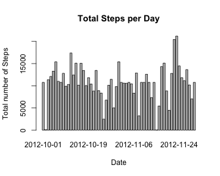
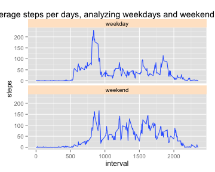

---
<<<<<<< HEAD
title: "Reproducible Research Peer Assessment 1"
author: "Rodney Joujoute"
date: "January 16, 2015"
output: html_document
---
# Peer Assessment 1

Here is my html page for Peer Asssessment 1 

First I set the environment. 

```r
knitr::opts_chunk$set(echo=TRUE)
setwd("/Users/rodneyjoujoute")
```

## Unzip and load the data into the console.


```r
unzip("repdata-data-activity.zip")
```

```
## Warning in unzip("repdata-data-activity.zip"): error 1 in extracting from
## zip file
```

```r
activity<-read.csv("activity.csv", stringsAsFactors = FALSE)
```

```
## Warning in file(file, "rt"): cannot open file 'activity.csv': No such file
## or directory
```

```
## Error in file(file, "rt"): cannot open the connection
```

```r
str(activity)
```

```
## 'data.frame':	17568 obs. of  4 variables:
##  $ interval: int  0 0 0 0 0 0 0 0 0 0 ...
##  $ steps   : num  1.72 0 0 0 0 ...
##  $ date    : Date, format: "2012-10-01" "2012-11-23" ...
##  $ dayType : chr  "weekday" "weekday" "weekend" "weekday" ...
```

Change the date which is a string variable now, to a date type

```r
activity$date<-as.Date(activity$date, format = '%Y-%m-%d')
head(activity)
```

```
##   interval    steps       date dayType
## 1        0 1.716981 2012-10-01 weekday
## 2        0 0.000000 2012-11-23 weekday
## 3        0 0.000000 2012-10-28 weekend
## 4        0 0.000000 2012-11-06 weekday
## 5        0 0.000000 2012-11-24 weekend
## 6        0 0.000000 2012-11-15 weekday
```

## What is the mean total number of steps taken per day?

Aggrigating by date

```r
total_daily_steps <- aggregate(steps~date, activity,sum, na.rm=TRUE)
```

1. Make a histogram of the total number of steps taken each day

```r
histogram <-barplot(total_daily_steps$steps, names.arg =total_daily_steps$date, xlab = "Date",ylab="Total Daily Steps", main="Number of Steps per Day")
```

 

2. Calculate and report the mean and median total number of steps taken per day

```r
daily_mean_steps<- mean(total_daily_steps$steps,na.rm=TRUE)
```


```r
daily_median_steps<-median(total_daily_steps$steps,na.rm=TRUE)
```

The daily **mean** steps is 10766 and the **median** is 10765.

## Finding the average daily activity pattern

1. Make a time series plot (i.e. type = "l") of the 5-minute interval (x-axis) and the average number of steps taken, averaged across all days (y-axis)

```r
average_interval <- aggregate(steps ~ interval, activity, mean)
plot(average_interval, type = "l", xlab="Intervals", ylab="Average Steps per interval", main="Average steps per interval")
```

 

2. Which 5-minute interval, on average across all the days in the dataset, contains the maximum number of steps?

```r
average_interval$interval[which.max(average_interval$steps)]
```

```
## [1] 835
```

## Input the missing values

1. Calculate and report the total number of missing values in the dataset (i.e. the total number of rows with NAs)

```r
sum(!complete.cases(activity))
```

```
## [1] 0
```

2. Devise a strategy for filling in all of the missing values in the dataset. The strategy does not need to be sophisticated. For example, you could use the mean/median for that day, or the mean for that 5-minute interval, etc.I prefer to use mean to fill the missing value

3.Create a new dataset that is equal to the original dataset but with the missing data filled in.

```r
activity <- merge(activity,average_interval, by = "interval", suffixes = c("", 
    ".y"))
nas <- is.na(activity$steps)
activity$steps[nas] <- activity$steps.y[nas]
activity <- activity[, c(1:3)]
```

4. Make a histogram of the total number of steps taken each day.

```r
total_steps_per_day <- aggregate(steps ~ date,activity,sum)
barplot(total_steps_per_day$steps, names.arg = total_steps_per_day$date, xlab = "Date", ylab = "Total number of Steps",main="Total Steps per Day")
```

 

Calculate and report the mean and median total number of steps taken per day. Do these values differ from the estimates from the first part of the assignment? What is the impact of imputing missing data on the estimates of the total daily number of steps?
Mean

```r
mean(total_steps_per_day$steps)
```

```
## [1] 10766.19
```

Median

```r
median(total_steps_per_day$steps)
```

```
## [1] 10766.19
```

According to the figures above, the mean and median are equal.

## Are there differences in activity patterns between weekdays and weekends?

1. Create a new factor variable in the dataset with two levels weekday and weekend indicating whether a given date is a weekday or weekend day. 

```r
activity$dayType <- ifelse(weekdays(activity$date) %in%  c("Saturday", "Sunday"),'weekend','weekday')
head(activity)
```

```
##   interval    steps       date dayType
## 1        0 1.716981 2012-10-01 weekday
## 2        0 0.000000 2012-11-23 weekday
## 3        0 0.000000 2012-10-28 weekend
## 4        0 0.000000 2012-11-06 weekday
## 5        0 0.000000 2012-11-24 weekend
## 6        0 0.000000 2012-11-15 weekday
```


```r
table(activity$dayType)
```

```
## 
## weekday weekend 
##   12960    4608
```

2. Make a panel plot containng a time series plot (i.e type "i") of the 5-minute interval (x-axis) and the average number of steps taken, averaged aross all weekday dats or weekend days (y-axis)


```r
library(ggplot2)
qplot(x=interval, y=steps,data=subset(activity, complete.cases(activity)),geom='smooth', stat='summary', fun.y=mean) + facet_grid(dayType~.) + facet_wrap(~dayType,nrow=2) + theme(strip.background = element_rect(fill="#ffe5cc")) + labs(title=' Average steps per days, analyzing weekdays and weekend patterns')
```

 

